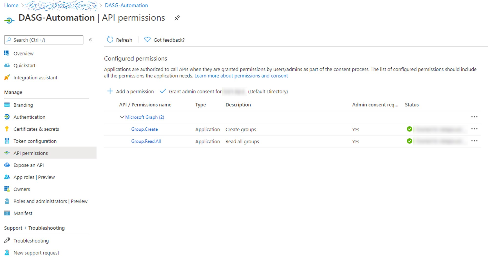

# Data Asset Security Groups

## Overview

Set-DASG-ADLS manages the creation of data asset groups in AAD as security groups and grants ADLS G2 ACLs to the DASG.

This function leverages Azure and Microsoft Graph APIs to automate group creation and ACL provisioning in ADLS.
The Set-DASG-ADLS function operates idempotently if groups, assets already exist, and updates permissions to match desired config.

If `recursive` mode is enabled, all objects (files/folders) beneath are updated to reflect changes using server-side ACL update.

If `createIfNotExists` mode enabled, the path is created in the target storage account as a folder, and the permissions set accordingly.

## Setup

In order to use this script, you'll need a service principal (SPN, or app registration in AAD) with API permissions as shown below.

In addition the SPN needs "blob storage contributor" RBAC on respective ADLS G2 storage accounts. 



## Usage

```powershell
Set-DASG-ADLS -node $node -accessLevel $accessLevel -path $path -groupOwner $groupOwner -recursive $recursive -createIfNotExists $createIfNotExists -AzCtx $AzCtx -GraphToken $GraphToken -Verbose
```

```
    .PARAMETER Node - Prefix to add to created security group name
    .PARAMETER accessLevel - RWX, order is important
    .PARAMETER path - full ADLS resource URI abfss or https format. 
    .PARAMETER groupOwner - not used
    .PARAMETER recursive - update permissions of all child items 
    .PARAMETER createIfNotExists - if the path doesnt exist, create it
    .PARAMETER AzCtx - the context (tenant+subscription) used to connect to Azure
    .PARAMETER GraphToken - securestring OAuth Microsoft Graph token for the SPN
```

Paths can be either in abfss or http format ([ADLS URI details](https://docs.microsoft.com/en-us/azure/storage/blobs/data-lake-storage-introduction-abfs-uri)).

> `abfs[s]://<file_system>@<account_name>.dfs.core.windows.net/<path>/<file_name>`
> `http[s]://<account_name>.blob.core.windows.net/<file_system>/<path>/<file_name>`

AzCtx variable can be retrieved by connecting to Azure control plane.

``` Powershell
$ctx = Connect-AzAccount -ServicePrincipal -Credential $Credential -TenantId $TenantId
$AzCtx = Select-AzSubscription -SubscriptionName $node
```

GraphToken is an variable can be retrieved by connecting to Azure control plane.

``` Powershell
$ReqTokenBody = @{
    Grant_Type    = "client_credentials"
    scope         = "https://graph.microsoft.com/.default"
    client_Id     = $ApplicationId
    Client_Secret = $clientSecret
}
$TokenResponse = Invoke-RestMethod -Uri "https://login.microsoftonline.com/$TenantId/oauth2/v2.0/token" -Method POST -Body $ReqTokenBody -ErrorAction Stop
$GraphToken = ConvertTo-SecureString -String $TokenResponse.access_token -AsPlainText -Force
Remove-Variable TokenResponse
```

## Limitations/Improvements

1. Security group names can't be longer than 120 characters. If this length is exceeded the function will attempt to shorten the name. Logic needs to be developed to detect clashes/conflicts if multiple groups shortened to same name. This can be mitigated using [Graph group object schema customisation](https://docs.microsoft.com/en-us/graph/extensibility-schema-groups).

1. Currently return object doesn't summarise success/failure state of call.

1. API calls don't currently retry in case of service throttling.

1. This isn't production grade code.

## Disclaimer

THE SOFTWARE IS PROVIDED "AS IS", WITHOUT WARRANTY OF ANY KIND, EXPRESS OR
IMPLIED, INCLUDING BUT NOT LIMITED TO THE WARRANTIES OF MERCHANTABILITY,
FITNESS FOR A PARTICULAR PURPOSE AND NONINFRINGEMENT. IN NO EVENT SHALL THE
AUTHORS OR COPYRIGHT HOLDERS BE LIABLE FOR ANY CLAIM, DAMAGES OR OTHER
LIABILITY, WHETHER IN AN ACTION OF CONTRACT, TORT OR OTHERWISE, ARISING FROM,
OUT OF OR IN CONNECTION WITH THE SOFTWARE OR THE USE OR OTHER DEALINGS IN THE
SOFTWARE